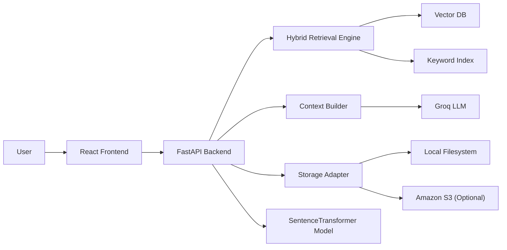
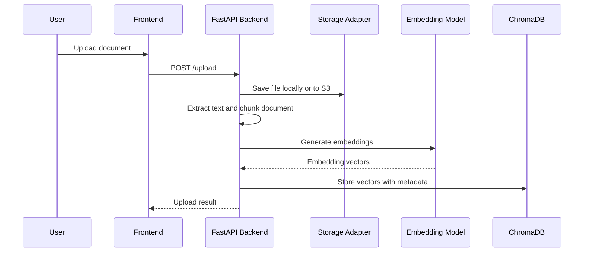
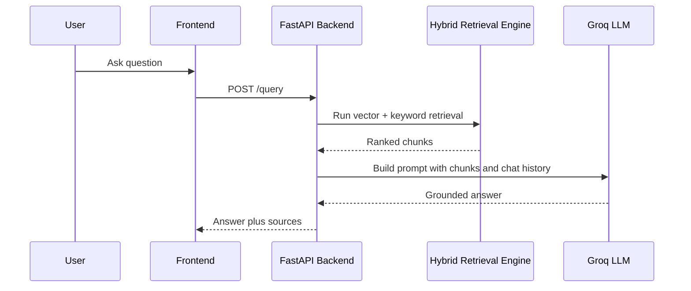
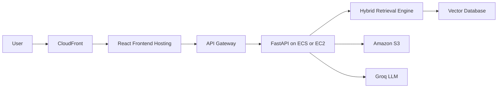

# AI Knowledge Assistant

A containerized Retrieval Augmented Generation application for document question-answering. The system supports local-first development by default and can be switched to S3-backed storage later through environment variables without changing code.

## Project Overview

This project demonstrates:

- AI system design for a production-leaning RAG workflow
- FastAPI backend development
- React frontend development
- vector search with ChromaDB
- hybrid retrieval with vector plus keyword ranking
- Groq LLM integration
- SentenceTransformer embeddings
- Docker-based deployment
- local-first storage with optional S3 support
- structured logging and health monitoring

## Technology Stack

- Frontend: React
- Backend: FastAPI
- LLM: Groq
- Embeddings: SentenceTransformers
- Vector database: ChromaDB
- Storage: local filesystem by default, optional Amazon S3
- Containerization: Docker and Docker Compose

## Storage Modes

The backend supports two storage modes:

- `STORAGE_MODE=local`
  Documents are saved to `backend/data/documents`
- `STORAGE_MODE=s3`
  Documents are stored in Amazon S3 using AWS credentials from environment variables

Local mode is the default and does not require any AWS credentials.

## System Architecture

### RAG Architecture



### Document Ingestion Pipeline



### Query Retrieval Pipeline



### Cloud Deployment Architecture



More architecture notes are available in [docs/architecture.md](docs/architecture.md) and [docs/data-flow.md](docs/data-flow.md).

## Core Features

- Upload PDF, TXT, and Markdown documents
- Save documents locally by default
- Switch to S3 later with `STORAGE_MODE=s3`
- Extract, clean, and chunk text
- Generate embeddings and store them in ChromaDB
- Run hybrid retrieval with vector search plus TF-IDF keyword search
- Re-rank candidate chunks before answer generation
- Search documents without calling the LLM via `GET /search`
- Ask grounded questions over indexed content
- View source chunks and similarity scores
- View previous and next chunk context in source previews
- Track multi-turn conversations and session identifiers
- Delete and reindex documents
- Expose health monitoring with `GET /health`
- Emit structured production-friendly logs

## Runtime Configuration

Important backend environment variables:

- `STORAGE_MODE`
- `DOCUMENT_STORAGE_PATH`
- `TOP_K`
- `CHUNK_SIZE`
- `CHUNK_OVERLAP`
- `MODEL_NAME`
- `GROQ_API_KEY`
- `GROQ_CHAT_MODEL`

Future AWS-only variables:

- `AWS_ACCESS_KEY_ID`
- `AWS_SECRET_ACCESS_KEY`
- `AWS_REGION`
- `S3_BUCKET`
- `S3_ENDPOINT_URL`

Example file: [backend/.env.example](backend/.env.example)

## How To Run Locally

### Backend

```bash
cd backend
pip install -r requirements.txt
uvicorn app.main:app --host 127.0.0.1 --port 9000 --reload
```

Default local development mode:

```env
STORAGE_MODE=local
```

If port `9000` is already in use, run on another port:

```bash
uvicorn app.main:app --host 127.0.0.1 --port 9100 --reload
```

The backend runs on [http://127.0.0.1:9000](http://127.0.0.1:9000) unless you choose another port.

### Frontend

```bash
cd frontend
npm install
set REACT_APP_API_BASE_URL=http://localhost:9000
npm start
```

If the backend is running on a different port, update the frontend API base URL accordingly:

```bash
set REACT_APP_API_BASE_URL=http://localhost:9100
```

The frontend runs on [http://localhost:3000](http://localhost:3000).

## Docker

Run the full application with:

```bash
docker compose up --build
```

This starts:

- `frontend` on `http://localhost:3000`
- `backend` on `http://localhost:9000`
- `chromadb` on `http://localhost:8001`

Docker uses local storage mode by default, so AWS credentials are not required.

Inside the Docker network:

- the frontend container proxies API traffic to `http://backend:9000`
- the backend connects to ChromaDB through `chromadb`
- uploaded documents are saved to the mounted local storage path

## Enabling S3 Later

To switch to AWS storage in production:

```env
STORAGE_MODE=s3
AWS_ACCESS_KEY_ID=...
AWS_SECRET_ACCESS_KEY=...
AWS_REGION=us-east-1
S3_BUCKET=your-bucket-name
S3_ENDPOINT_URL=
```

No code changes are required. The storage adapter will route uploads, downloads, and deletes to S3 automatically.

## Health Monitoring

Use:

```bash
GET /health
```

Example response:

```json
{
  "status": "ok",
  "vector_db": "connected",
  "model_loaded": true,
  "storage": "connected"
}
```

In local mode, startup logs should show the local storage path and a ready state without AWS credentials.

## Deployment Guide

### Recommended AWS Deployment

1. Host the frontend behind CloudFront.
2. Put API Gateway in front of the FastAPI service.
3. Deploy FastAPI to ECS or EC2.
4. Set `STORAGE_MODE=s3`.
5. Store uploaded documents in S3.
6. Use a managed or self-hosted vector database.
7. Provide secrets and runtime config through environment variables or a secret manager.

### Production Notes

- Move metadata storage from local JSON files to a durable database.
- Restrict CORS to known frontend origins.
- Add centralized log aggregation and alerting.
- Add authentication before exposing document upload/query publicly.

## Final Goal

The application supports a full document-QA workflow:

- upload documents
- search documents
- ask questions about those documents
- receive grounded AI answers
- inspect the exact sources used for the response
