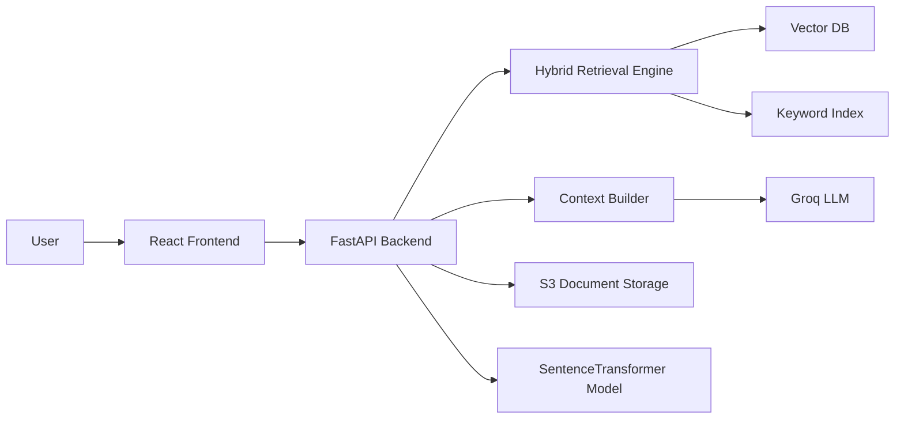
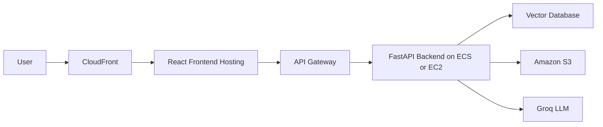

# Architecture

## RAG architecture

```mermaid
flowchart LR
    User["User"] --> Frontend["React Frontend"]
    Frontend --> API["FastAPI Backend"]
    API --> Hybrid["Hybrid Retrieval Engine"]
    Hybrid --> Chroma["Vector DB"]
    Hybrid --> Keyword["Keyword Index"]
    API --> Context["Context Builder"]
    Context --> LLM["Groq LLM"]
    API --> S3["S3 Document Storage"]
    API --> Embed["SentenceTransformer Model"]
```

## Cloud deployment architecture

```mermaid
flowchart LR
    User["User"] --> CloudFront["CloudFront"]
    CloudFront --> Frontend["React Frontend Hosting"]
    Frontend --> APIGW["API Gateway"]
    APIGW --> Backend["FastAPI Backend on ECS or EC2"]
    Backend --> Vector["Vector Database"]
    Backend --> S3["Amazon S3"]
    Backend --> LLM["Groq LLM"]
```
