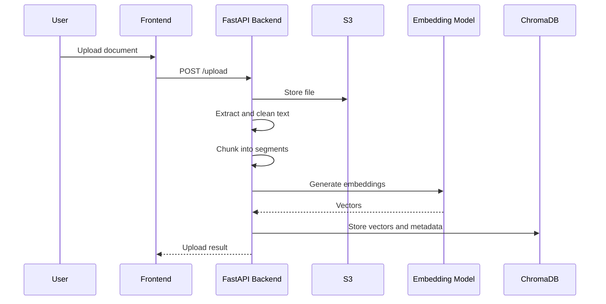
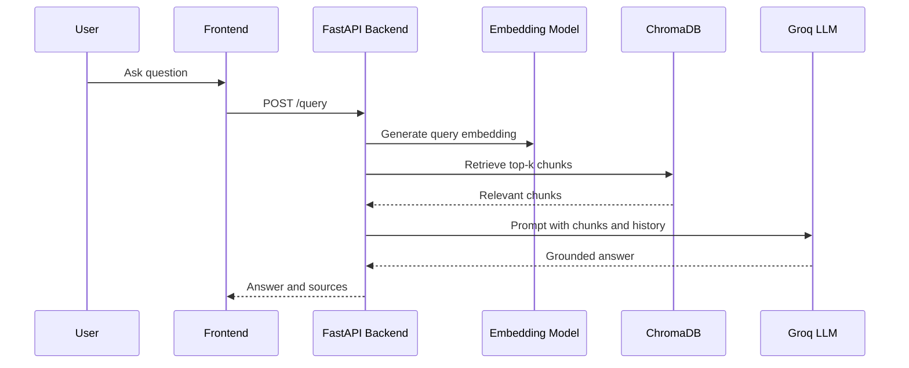

# Data Flow

## Document ingestion pipeline

```mermaid
sequenceDiagram
    participant U as User
    participant F as Frontend
    participant B as FastAPI Backend
    participant S as S3
    participant E as Embedding Model
    participant V as ChromaDB

    U->>F: Upload document
    F->>B: POST /upload
    B->>S: Store file
    B->>B: Extract and clean text
    B->>B: Chunk into segments
    B->>E: Generate embeddings
    E-->>B: Vectors
    B->>V: Store vectors and metadata
    B-->>F: Upload result
```

## Query retrieval pipeline

```mermaid
sequenceDiagram
    participant U as User
    participant F as Frontend
    participant B as FastAPI Backend
    participant E as Embedding Model
    participant V as ChromaDB
    participant G as Groq LLM

    U->>F: Ask question
    F->>B: POST /query
    B->>E: Generate query embedding
    B->>V: Retrieve top-k chunks
    V-->>B: Relevant chunks
    B->>G: Prompt with chunks and history
    G-->>B: Grounded answer
    B-->>F: Answer and sources
```
